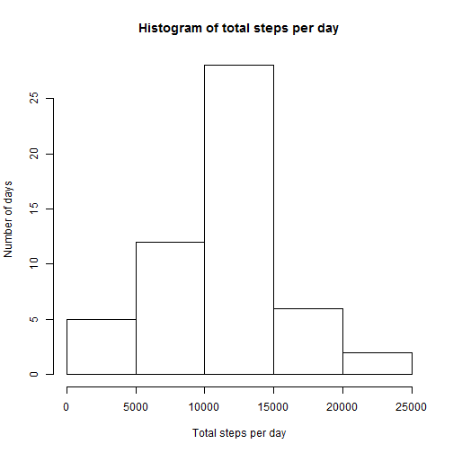
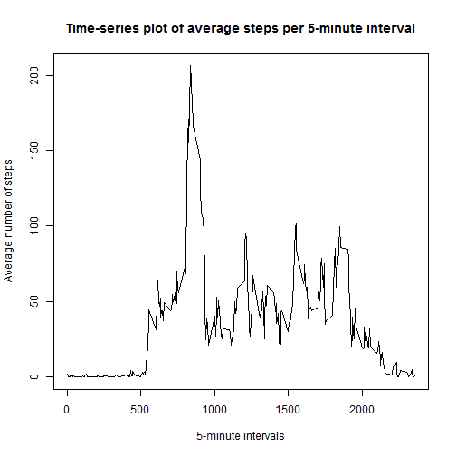
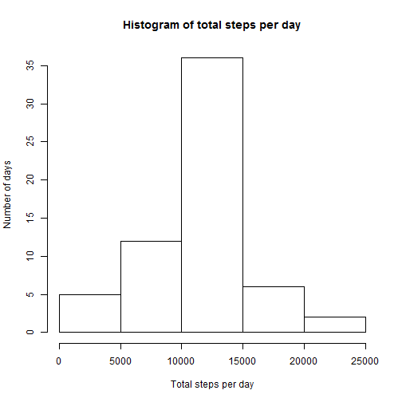

Reproducible Research: Peer Assessment 1
========================================================


## Loading and preprocessing the data

In this first step, the zipped csv file included in the current repository 
(*"activity.csv"*) is loaded, and the date field is formatted for later use of 
*weekdays()* function. Options are also set for numerical outputs in the text, 
i.e. means and medians, to appear in fixed rather than scientific format. 


```r
options(scipen = 1)
pa1data <- read.csv(unz("activity.zip", "activity.csv"), 
                    colClasses = c("numeric", "Date", "integer"))
```

## What is mean total number of steps taken per day?

For this part of the project, the totals per day are computed using the 
*tapply* command, and stored in a vector named *pa1perday*. A histogram is then 
produced, with frequencies on the y axis, i.e. number of days, by total number 
of steps per day on the x axis.


```r
pa1perday <- with(pa1data, tapply(steps, date, sum))
hist(pa1perday, main = "Histogram of total steps per day", 
     xlab = "Total steps per day", ylab = "Number of days")
```

 

Next, the summary function is called to compute the mean and median values, 
which are then reported both as output of the code chunk and as inline text 
computations in the following lines of text.


```r
pa1sum <- summary(pa1perday)
pa1sum[c(3,4)]
```

```
## Median   Mean 
##  10760  10770
```

The mean total number of steps taken per day is 10760 and the median 
total number is 10770.

## What is the average daily activity pattern?

This time, the average number of steps per 5-minute interval is computed with 
the function *aggregate()*, producing the data frame called *pa1perint*. Missing 
values are excluded from the calculations. Then, a time series plot is created 
for average steps on the y axis per 5-minute intervals on the x axis.


```r
pa1perint <- aggregate(steps ~ interval, pa1data, mean, na.rm = TRUE)
plot(pa1perint$interval, pa1perint$steps, type="l", 
     main = "Time-series plot of average steps per 5-minute interval", 
     xlab = "5-minute intervals", ylab = "Average number of steps")
```

 

And now, the 5-minute interval where the maximum average number of steps were 
taken is identified, again both as R code output and inline in the text.


```r
maxint <- pa1perint$interval[which.max(pa1perint$steps)]
maxint
```

```
## [1] 835
```

The 5-minute interval where the maximum number of steps was taken on average 
was the interval 835.

## Imputing missing values

Here we start by finding the number of rows of data with missing values in the 
original data. It is again reported both as R output and inline as text.


```r
nasum <- sum(is.na(pa1data$steps))
nasum
```

```
## [1] 2304
```

The number of rows with missing value in the original data is 2304.  
  
Next, we impute the average steps per 5-minute interval for each missing value. 
This is done by merging the averages stored in the data frame created for the 
previous section with the original data, on the 5-minute intervals, and then 
replacing the missing values with the corresponding average. Note that the 
column name for average steps is changed, to keep the resulting names as in the 
original data, and the added column is dropped once the missing values are 
replaced, so that the new dataset is equal to the original, except for the 
missing values replaced.


```r
colnames(pa1perint)[2] <- "meansteps"
pa1impd <- merge(pa1data, pa1perint, by = "interval")
pa1impd$steps[is.na(pa1impd$steps)] <- pa1impd$meansteps[is.na(pa1impd$steps)]
pa1impd <- pa1impd[, 1:4]
```

With this new data, we replicate the work done in the first section, to produce 
the corresponding histogram, and calculate and report the mean and median total 
number of steps taken in each day (in R output and inline).


```r
pa1impday <- with(pa1impd, tapply(steps, date, sum))
hist(pa1impday, main = "Histogram of total steps per day", 
     xlab = "Total steps per day", ylab = "Number of days")
```

 

```r
pa1impsum <- summary(pa1impday)
pa1impsum[c(3,4)]
```

```
## Median   Mean 
##  10770  10770
```

The mean total number of steps taken per day is 10770 and the median 
total number is 10770.  
  
As we can see, the middle bin of the histogram now includes the days where the 
missing values were replaced with the averages across all days. As is to be 
expected, the mean total number of steps remains the same, since missing values 
were replaced for entire days with the average data, and the median moved to 
be equal to the mean, as the median observation is now one of the days where 
missing values were replaced by the average values.

## Are there differences in activity patterns between weekdays and weekends?

For this last section of the assessment, we first create a new factor variable, 
called *daytype*, and compute averages of steps take per *interval* and *daytype* 
to produce the data frame *pa1impint*. This is then used to create a 2-panel 
time series plot, using the lattice package. Note that a warning message is 
issued when the package is loaded.


```r
pa1impd$daytype <- as.factor(ifelse(weekdays(pa1impd$date) %in% 
                             c("Saturday","Sunday"), "weekend", "weekday"))
pa1impint <- aggregate(steps ~ interval + daytype, pa1impd, mean)
library(lattice)
xyplot(steps ~ interval | daytype, pa1impint, type = "l", layout = c(1,2), 
       xlab = "Interval", ylab = "Number of steps")
```

 
